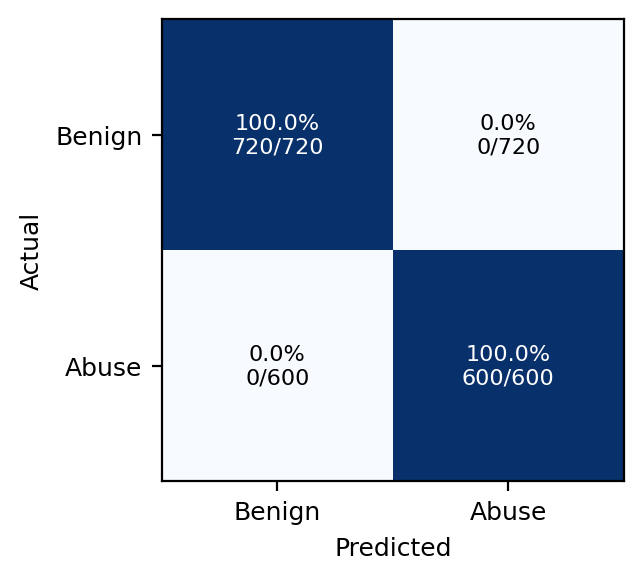
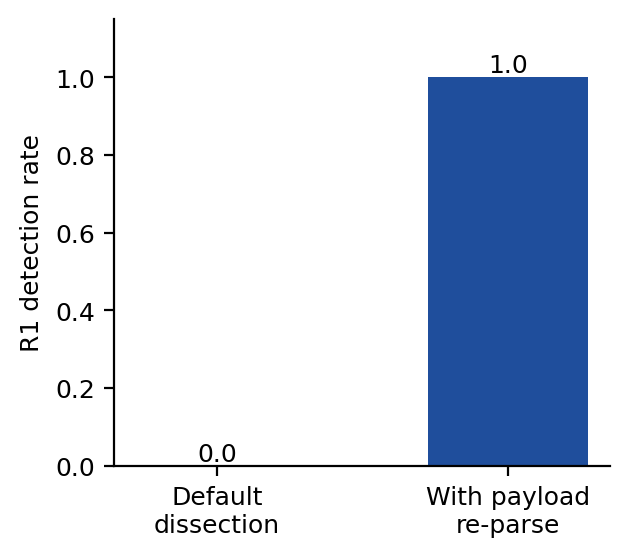
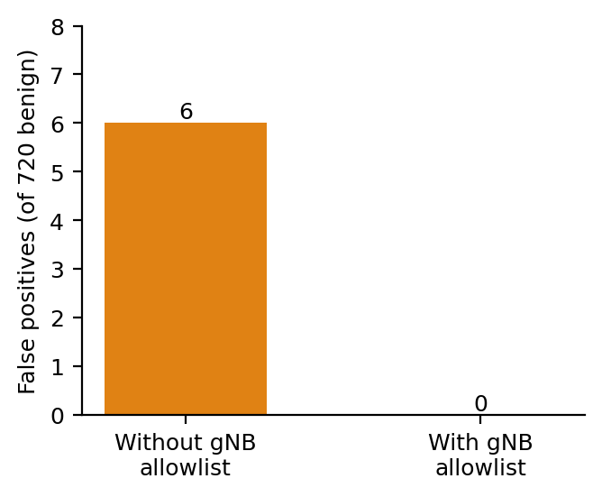
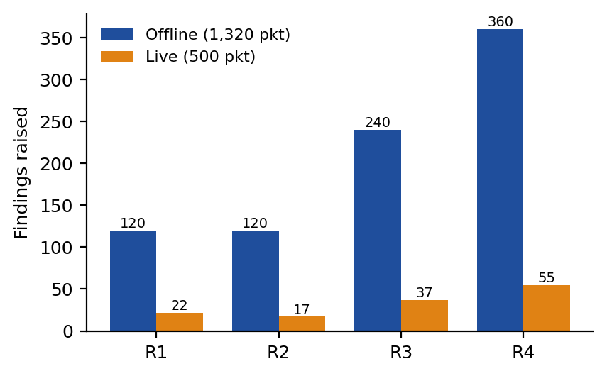
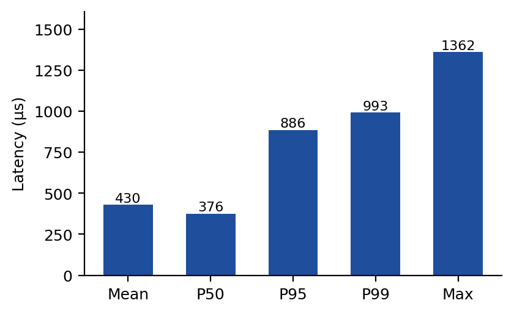

# Passive detection of GTP-U tunnel abuse in 5G/4G user-plane traffic with an open, reproducible testbed and a four-rule detection engine

Joseph Kwabena Fiagbor<sup>a,\*</sup>, Oliver Kornyo<sup>a</sup>

<sup>a</sup> Department of Computer Science, Kwame Nkrumah University of Science and Technology, Kumasi, Ghana

---

## Abstract

GTP-U, the user-plane component of the GPRS Tunnelling Protocol, carries subscriber IP traffic between the radio access network and the mobile core over interfaces such as N3 in 5G and S1-U in 4G. It normally runs as plain UDP on port 2152, with neither authentication nor encryption between network elements that are assumed to trust one another. That assumption is a deployment property rather than a protocol guarantee, and recent work has shown it failing in practice: an attacker-controlled handset can tunnel control-plane protocols through N3 and reach internal core functions across several commercial and open-source cores. This paper presents *gtpu-abuse-lab*, an open, Dockerized testbed that combines a real Open5GS 5G core, a real UERANSIM base-station and handset simulator, a passive Scapy-based detector and a labelled abuse generator on an isolated bridge under the test PLMN 999/70. The detector applies four rules: nested GTP tunnels, TEID spoofing, control-plane protocols smuggled inside user-plane data, and inner traffic addressed to core network functions rather than to the data network.

The detector is evaluated on a seeded 1,320-packet labelled corpus whose 720 benign packets span twelve traffic categories, including two deliberately adversarial ones: non-IP Unstructured-PDU payloads crafted to collide with the detector's nested-tunnel heuristic, and legitimate Xn handovers that are structurally indistinguishable from TEID spoofing on the user plane alone. On this corpus the detector reaches precision 1.0, recall 1.0, F1 1.0 and a false-positive rate of 0.0, with zero standard deviation across five seeds, at a mean per-packet cost of 686 µs including packet dissection. Three further results accompany the headline score rather than replacing it: a naive baseline that differs only in omitting the payload re-parse misses 100% of nested tunnels (F1 0.889); a false-positive ablation traces every residual false alarm, six in 720 benign packets, to legitimate handovers and removes them with an operator-supplied gNB allowlist; and an eleven-case evasion suite states explicitly which crafted evasions the detector catches (six) and which are documented blind spots of a stateless user-plane-only rule (five). The same engine was then exercised against genuinely transmitted traffic from a live 5G core and radio simulator, where it raised 131 findings across all four rules with no crashes.

The study also reports two robustness results. First, the default Scapy dissection of GTP-U returns a nested GTP header as opaque bytes, so a naive layer check misses every nested-tunnel packet on captured or live traffic while an in-memory unit test still passes; a payload re-parse restores nested-tunnel detection from 0.0 to 1.0. Second, bringing the live path up for the first time exposed five real defects that a fully passing offline suite could not reach, including a generator that had been emitting malformed Ethernet frames on every live run. Taken together, the results support a practical recommendation: for security tools that read or write real wire traffic, an offline suite that only replays or builds packets in memory is necessary but not sufficient, and a corpus whose negative class lacks diversity is a third way for a passing suite to mislead.

**Keywords:** GTP-U; 5G core security; user-plane security; passive intrusion detection; reproducible testbed; Open5GS

---

## 1. Introduction

Mobile networks carry subscriber data through GTP-U tunnels. In 5G the interface of interest is N3, between the base station (gNB) and the User Plane Function (UPF); in 4G the equivalent is S1-U. Each tunnel is identified by a Tunnel Endpoint Identifier (TEID) that is only locally meaningful, assigned by the receiving endpoint at tunnel setup. The protocol does not cryptographically bind a TEID either to its source or to the subscriber session it represents. In production deployments this is handled by keeping GTP-U on trusted transport, so that only equipment the operator controls can place packets on the segment.

That isolation is a deployment assumption rather than a protocol guarantee. Shaik et al. (2025) recently demonstrated the assumption failing in practice: an attacker-controlled handset was able to tunnel control-plane protocols through the user plane and interact with internal core functions across six open-source and commercial 5G core deployments. Earlier, a single malformed GTP-U packet sent from a handset was shown to crash the UPF of a widely used open-source core (Trend Micro, 2023). A party who reaches the transport segment, whether through a compromised base station, a misconfigured roaming interconnect or insider access, is therefore in a position to place arbitrary UDP packets onto N3.

Four classes of abuse follow directly from that position. **Nested tunnels** (GTP-in-GTP) place a second GTP header inside what should be a plain IP user payload, which can smuggle traffic past inspection points that parse only one layer, or push traffic towards equipment that treats the inner tunnel as legitimate. **TEID spoofing** sends traffic bearing a TEID that belongs to another subscriber's session from an unexpected source address, which can hijack, inject into or disrupt that session. **Control-plane smuggling** wraps PFCP (the N4 protocol between the SMF and the UPF), GTP-C or NGAP inside a user-plane payload, so that control-plane messages travel through a data-plane path that is usually less closely watched. **Inner-traffic misdirection** places an inner IP packet, inside an otherwise normal-looking tunnel, addressed to an internal core function such as the UPF, SMF or AMF rather than to the external data network.

Despite this, the published security literature of the last five years remains concentrated on the control plane. Fuzzing of RAN-core interfaces (Bennett et al., 2024), analysis of baseband control-plane protocols (Tu et al., 2024), attacks on the N4 interface (Amponis et al., 2022) and evaluation guidance for anomaly detection built on PFCP attack traffic (Manca et al., 2026) all target signalling. Garg and Amaral Cejas (2026) note that labelled examples of real attacks are scarce and treat GTP as under-served relative to SS7 and Diameter. The best-known user-plane results, aLTEr and IMP4GT (Rupprecht et al., 2019, 2020), establish that the user plane lacks integrity protection, but they operate at the radio layer through a relay rather than on the GTP-U tunnel inside the network.

Commercial GTP firewalls are sold against exactly this class of abuse, but they are closed appliances whose detection logic, false-positive behaviour and performance are not independently verifiable, and there is no small, reproducible, open testbed that lets a researcher test a detection approach against a real 5G core rather than against a static capture of unknown origin. The public datasets that would otherwise serve, including the PFCP intrusion dataset of Amponis et al. (2023), 5G-NIDD (Samarakoon et al., 2022) and CICIDS2017 (Sharafaldin et al., 2018), contain no GTP-U tunnel-abuse traffic, so a detector evaluated on them never encounters nested tunnels, spoofed TEIDs or inner-to-core packets.

To summarize, the significance of this work is as follows:

- An open, Dockerized and reproducible testbed that combines a real Open5GS 5G core and a UERANSIM radio simulator on an isolated 10.10.10.0/24 bridge under the test PLMN 999/70, together with a passive detector and a labelled attack generator.
- A four-rule passive detection engine, evaluated against a diverse rather than a degenerate negative class. On a seeded 1,320-packet corpus whose 720 benign packets span twelve traffic categories, including adversarial Unstructured-PDU bytes and legitimate handovers, it reaches precision, recall and F1 of 1.0 with a false-positive rate of 0.0, with zero variance across five seeds. The evaluation adds three things a bare score omits: a naive-baseline comparison that measures the contribution rather than asserting it, a false-positive analysis that traces every residual false alarm to a single cause and then mitigates it, and an evasion suite that states the detector's blind spots explicitly. The generator, the scorer and the report renderer are all included and run with two pip installs, without root and without Docker.
- A robustness finding inside the detector itself. The default Scapy dissection of a GTP-U payload reads a nested GTP header as opaque bytes, so a naive layer check on captured or live traffic misses every nested-tunnel packet, while an in-memory unit test that builds the layers directly in Python still passes. The detector re-parses the payload to close this gap, which restores nested-tunnel detection from 0.0 to 1.0 without introducing a single false positive on the adversarial benign categories.
- Live validation of the same engine against genuinely transmitted 5G traffic, confirming that it detects the same rule classes on the wire that it detects offline, together with an explicit statement of what the live experiment does and does not model.
- A documented case study of five defects found only by running the live path, including a traffic generator that had been sending malformed Ethernet frames on every live run since the project began.

This study contributes to user-plane security in mobile core networks by turning a set of abuse categories that are currently described in prose into rules that can be read, run and measured, and by supplying both the labelled traffic and the live infrastructure needed to check them. It further contributes a methodological result about how such tools should be validated, derived from defects found in the authors' own code.

The remainder of the paper is organised as follows. Section 2 presents the background and related works. Section 3 expounds on the materials and method, including the testbed architecture, the corpus, the detection rules and the performance measures used. Experimental results and findings are presented and discussed in Section 4. Section 5 presents the study's conclusion and possible areas for future work.

---

## 2. Background and related works

### 2.1. GTP-U and its place in the mobile core

GTP-U (3GPP TS 29.281) tunnels user-plane IP traffic over UDP, normally on port 2152. In 5G the interface of interest is N3, between the gNB and the UPF. It carries every subscriber's data traffic, keyed per session by a TEID that the receiving endpoint assigns at tunnel setup. Two neighbouring interfaces matter for the threat model. N2 carries signalling between the gNB and the AMF over NGAP on SCTP, and is meant to remain separate from N3. N4 carries PFCP between the SMF and the UPF (3GPP TS 29.244), and it too is meant to remain separate from user-plane traffic. The abuse classes set out in Section 1 are all attempts to blur that separation, or to exploit the fact that GTP-U does not bind a TEID to a subscriber.

### 2.2. Threat model

The detector is designed against an attacker who can inject arbitrary UDP packets onto the N3 segment, which is the position a compromised base station, a misconfigured roaming partner or an insider would hold. It does not model an attacker who has taken over the UPF or the SMF, which is a stronger and separate problem addressed elsewhere (Sturm et al., 2026), and it does not model radio-layer attacks. The detector is a passive tap: it observes N3 traffic and raises findings, and it does not block or reshape anything. This matches where a production GTP firewall usually sits, in front of or across the UPF's N3 interface rather than inside its forwarding path.

One clarification is required, because it bears on how the live experiment of Section 4.7 should be read. In the containerised laboratory the attack generator shares the core's network namespace, so the packets it transmits are genuinely serialised onto a socket and genuinely dissected off an interface, but they originate on the UPF host rather than arriving from a remote endpoint on the N3 segment. The live experiment therefore validates the detector's behaviour on transmitted rather than replayed bytes; it does not by itself demonstrate detection of a remote N3 adversary. Section 4.10 records this as a limitation and Section 5 as future work.

### 2.3. Recent attacks on the 5G user plane and core

Shaik et al. (2025) provide the closest antecedent to this study. Working from an attacker-controlled handset, they show that protocol tunnelling and network boundary bridging allow user-plane traffic to reach internal core functions when routing, segmentation and validation policies are inconsistently enforced. Crafted PFCP or NGAP messages, encapsulated in GTP-U and forwarded by a UPF that lacks egress validation, can be delivered to the SMF or the AMF as though they had originated on a trusted interface. Evaluating six open-source and commercial cores, they report misconfigurations and inconsistencies in routing enforcement, identifier management and interface segregation, and construct attack primitives covering data injection into handsets, charging fraud and traffic interception. Their work establishes that the abuse classes examined here are exploitable in real deployments rather than merely conceivable. It is, however, an offensive study: it produces attacks and mitigation recommendations, not a passive detector, a labelled corpus or any detection measurement.

Industry analysis reaches the same conclusion from a different direction. A malformed GTP-U packet sent from a handset was shown to crash the user-plane function of a widely deployed open-source core, with the resulting weakness assigned CVE-2021-45462, and GTP-in-GTP abuse originating from handsets has been reported against cores with exposed user-plane functions (Trend Micro, 2023). Sturm et al. (2026) take the threat further inside the network, chaining hidden command-and-control channels across 5G core interfaces once components have been compromised, which is a stronger attacker model than the one assumed here but underlines that interface separation cannot be presumed.

On the control plane, Amponis et al. (2022) demonstrated that unauthorised PFCP session-deletion, session-modification and flooding messages can tear down established GTP-U tunnels while the radio link remains up, so the handset still appears connected and the attack is correspondingly hard to notice. Amponis et al. (2023) released the resulting traffic as a labelled PFCP intrusion-detection dataset. These works confirm the value of a controllable containerised core as a research instrument, but their scope is N4 signalling; the user-plane abuse classes of interest here are not covered, and detection is deferred to a downstream classifier trained on the released data rather than expressed as rules an operator can read.

### 2.4. Analysis and fuzzing of the control plane

The largest share of recent effort continues to target control-plane implementations. Bennett et al. (2024) built RANsacked, a fuzzing framework for the RAN-core interfaces reachable from a base station or a handset, motivated explicitly by the rise of compromised base station attacks against the core. Tu et al. (2024) analysed the control-plane protocols of 5G basebands, and Hu et al. (2021) and Potnuru and Nakarmi (2021) fuzzed NGAP and RRC respectively. Earlier work established the pattern: Kim et al. (2019) found thirty-six previously undisclosed vulnerabilities in the LTE control plane on live networks, while Hussain et al. (2018, 2019b) and Basin et al. (2018) applied model checking and formal verification to LTE and 5G procedures and to 5G authentication. These are systematic, high-quality results, and RANsacked in particular reinforces the argument of Section 4.9 that driving a real implementation is where the interesting failures appear. None of them, however, examines how a user-plane GTP-U parser behaves on unexpected structure, which is precisely where the robustness finding reported in Section 3.7 lies.

### 2.5. User-plane security at the radio layer

Rupprecht et al. (2019) showed in aLTEr that LTE user-plane traffic, encrypted but not integrity-protected, can be manipulated and redirected on a commercial network, and Rupprecht et al. (2020) extended this in IMP4GT to full impersonation of the user or the network, noting that 5G inherits the weakness because user-plane integrity protection is not mandatory. Piqueras Jover and Marojevic (2019) found that null encryption and pre-authentication trust survive into the 5G specifications, so several 4G-style exploits carry over, and earlier measurement work on live networks established that privacy and availability attacks are practical with low-cost hardware (Shaik et al., 2016; Hong et al., 2018; Hussain et al., 2019a). These are the clearest published statements of the trust assumption this paper pushes on. They differ from the present work in position rather than in principle: the attacks require a relay at the radio layer, whereas the abuse examined here is placed directly on the N3 transport inside the network, where no relay is required and where a GTP firewall would be expected to intervene.

### 2.6. Detection and monitoring of mobile-core traffic

Detection work on the user plane is sparse and recent. Pineda et al. (2023) come closest, introducing an SDN-based telemetry framework for GTP-U traffic analysis in 5G cores; the framework profiles and monitors user-plane traffic rather than detecting tunnel abuse, and reports no abuse classes or detection metrics. Kim et al. (2022) apply random forest, support vector machine and neural network classifiers to GTP-U flow features to detect IoT botnets in a 5G core, and Park et al. (2022) use supervised learning to detect signalling denial-of-service in a 5G standalone core. Both operate on flow-level features, which by construction cannot inspect what is encapsulated inside a tunnel, and both target traffic volume or endpoint behaviour rather than tunnel structure. Garg and Amaral Cejas (2026) fuse SS7, Diameter and GTP signalling records per subscriber and apply unsupervised multi-embedding consensus, reporting that labelled examples of real attacks are scarce; their unit of analysis is the signalling record rather than the user-plane packet, and their detector is deliberately opaque. Manca et al. (2026) address the evaluation side with SAGE-5GC, a set of security-aware guidelines for evaluating anomaly detection in the 5G core, built over PFCP attack traffic, and show that adversarially crafted attacks substantially degrade detectors that scored well under controlled conditions. Their concerns echo the older but still applicable argument of Sommer and Paxson (2010) that machine-learning intrusion detection underdelivers operationally and that its evaluations tend to flatter themselves. Both directly motivate the design of Section 4: readable rules, an adversarial benign class, a measured baseline and an explicit evasion suite.

### 2.7. Labelled datasets for intrusion detection

Samarakoon et al. (2022) released 5G-NIDD, a fully labelled intrusion-detection dataset captured on a working 5G test network and now widely reused. Sharafaldin et al. (2018) produced CICIDS2017, a carefully labelled benchmark with realistic background traffic, and Moustafa and Slay (2015) produced UNSW-NB15. All three are valuable as methodological reference points for labelling and evaluation, and the first has genuine 5G provenance. None contains GTP-U tunnel-abuse traffic: 5G-NIDD captures generic IP-layer attacks such as floods and scans, while the other two are enterprise IT traffic with no cellular semantics. The more recent mobile-core datasets, from Amponis et al. (2023) and Manca et al. (2026), are control-plane PFCP corpora. A detector evaluated on any of them would therefore never be exercised on the abuse classes examined here, which is the direct motivation for the labelled corpus described in Section 3.5.

### 2.8. Industry guidance and closed appliances

GSMA (2023), in FS.20, sets out the principal categories of GTP abuse at the roaming and interconnect border and the filtering controls operators are expected to apply, and GSMA (2024), in FS.37, treats user-plane GTP-U threats on N3 and S1-U as an attack surface in their own right, naming the abuse cases addressed in this paper. ENISA (2025) provides comparable recent guidance across SS7, Diameter and 5G signalling. These documents are the authoritative statement of what the attacks look like and are used here as the source of the abuse taxonomy. Their limitation for research purposes is that they remain prescriptive: there is no detector, no test traffic and no measurement, so an operator cannot confirm from the guidance alone that a deployed control actually catches an abuse. The commercial GTP and signalling firewalls sold against these categories are closed appliances, whose rules, false-positive behaviour and throughput cannot be independently inspected or reproduced.

### 2.9. Open cores, simulators and packet tooling

Open5GS provides a standards-tracking implementation of the AMF, SMF, UPF and supporting functions in software, and UERANSIM provides a software gNB and handset that generate genuine NGAP, NAS and GTP-U traffic without radio hardware. free5GC offers a second independent core implementation and srsRAN a software-radio path to over-the-air testing. Salazar et al. (2021) released 5Greplay, an open fuzzer that replays and mutates signalling traffic against cores and intrusion-detection systems, and Salazar et al. (2023) added a mutation-based ontology for testing whether IDS rules survive traffic mutation; both produce attacks rather than detections, and both are oriented towards signalling. Scapy is the de-facto library for constructing and dissecting custom protocol traffic, GTP included, and Wireshark is the manual counterpart analysts use to read GTP by hand. One property of Scapy is central to this paper: its GTP-U dissector returns a nested GTP header as opaque bytes, so the obvious layer check misses GTP-in-GTP on real traffic while an in-memory test still passes. None of the detection literature reviewed here flags this behaviour, and closing it is one of the objectives of this study.

### 2.10. Summary of related works and research gaps

Table 1 summarises the reviewed literature against the concern of this study, with publication year shown so that recency is visible; the majority of the entries, and every entry that bears directly on the user plane, date from the last five years.

**Table 1.** Summary of reviewed literature and gaps relative to this study, newest first.

| Study | Year | Focus and key achievement | Gap relative to this study |
|---|---|---|---|
| Garg and Amaral Cejas | 2026 | Unsupervised cross-protocol anomaly analysis fusing SS7, Diameter and GTP signalling records per subscriber | Signalling records, not user-plane packets; opaque detector |
| Manca et al. (SAGE-5GC) | 2026 | Security-aware guidelines for evaluating anomaly detection in the 5G core, over PFCP attack traffic | Evaluation guidance on control-plane data; no user-plane detector or corpus |
| Sturm et al. (5G Puppeteer) | 2026 | Hidden command-and-control channels chained across 5G core interfaces | Assumes already-compromised core components; offensive, no detection |
| Shaik et al. | 2025 | Protocol tunnelling and boundary bridging from a handset reach internal core functions; six cores evaluated | Attack-side study; no passive detector, no labelled corpus, no detection metrics |
| ENISA | 2025 | Signalling security guidance across SS7, Diameter and 5G | Guidance only; nothing runnable or measurable |
| Bennett et al. (RANsacked) | 2024 | Domain-informed fuzzing of LTE and 5G RAN-core interfaces from a base station or handset | Control-plane message fuzzing; crash discovery rather than passive detection |
| Tu et al. | 2024 | Security analysis framework for 5G baseband control-plane protocols | Control plane and device side; user-plane tunnels out of scope |
| GSMA (FS.37) | 2024 | Treats user-plane GTP-U threats on N3 and S1-U as an attack surface in their own right | Abuse cases named but never implemented or measured |
| Amponis et al. | 2023 | Labelled PFCP intrusion-detection dataset released for machine-learning use | Control plane only; no user-plane abuse classes |
| Pineda et al. | 2023 | SDN-based telemetry framework for GTP-U traffic analysis in 5G cores | Monitoring and profiling, not abuse detection; no abuse classes or metrics |
| GSMA (FS.20) | 2023 | Authoritative taxonomy of GTP abuse and recommended interconnect filtering | Prescriptive; no detector, no traffic, no measurement |
| Trend Micro | 2023 | Malformed GTP-U from a handset crashes a UPF (CVE-2021-45462); GTP-in-GTP abuse reported in the field | Industry report; symptom-level, no reproducible detection artifact |
| Amponis et al. | 2022 | Unauthorised PFCP messages tear down GTP-U tunnels while the radio link stays up | Control-plane PFCP; detection deferred to a later dataset |
| Kim et al. | 2022 | Random forest, SVM and neural-network classifiers over GTP-U flow features for IoT botnet detection | Flow-level features cannot inspect encapsulated content; botnet traffic, not tunnel abuse |
| Park et al. | 2022 | Supervised detection of signalling DDoS in a 5G standalone core | Signalling volume; assumes full visibility; no tunnel semantics |
| Samarakoon et al. (5G-NIDD) | 2022 | Labelled intrusion dataset captured on a real 5G test network | Generic IP-layer attacks; no GTP-U tunnel-abuse classes |
| Salazar et al. | 2021, 2023 | 5Greplay traffic fuzzer and a mutation ontology for stressing IDS rules | Injector rather than detector; signalling-oriented |
| Hu et al.; Potnuru and Nakarmi | 2021 | Protocol-aware fuzzing of NGAP and of RRC | Control-plane and radio-control parsing; not GTP-U |
| Rupprecht et al. | 2019, 2020 | aLTEr and IMP4GT: user-plane traffic lacks integrity protection | Radio-layer relay attacks, not N3 tunnel abuse |
| Kim et al.; Hussain et al.; Basin et al.; Sharafaldin et al. | 2018, 2019 | Dynamic testing, formal analysis of LTE/5G procedures, and general IDS benchmarks | Control-plane procedures or enterprise IT traffic; no cellular user-plane semantics |
| Sommer and Paxson; Collberg and Proebsting | 2010, 2016 | Critiques of ML-IDS evaluation and of reproducibility in systems research | No artifact and no mobile-core instance |

Read together, the reviewed works leave three gaps.

**Gap 1.** The GTP-U user plane remains under-examined as an attack surface in its own right, even though recent work shows the trust boundary already failing there. Shaik et al. (2025) demonstrate a handset reaching internal core functions through the user plane across six deployments, and a single malformed GTP-U packet has been shown to crash a UPF (Trend Micro, 2023); yet the bulk of 2021 to 2026 analysis effort targets control-plane interfaces (Amponis et al., 2022; Bennett et al., 2024; Tu et al., 2024; Manca et al., 2026). Even the best-known user-plane results (Rupprecht et al., 2019, 2020) sit at the radio layer rather than on the N3 tunnel between the base station and the core.

**Gap 2.** There is no open, labelled and auditable basis on which detection of these abuses can be built or compared. The tools that do block GTP-U abuse are closed commercial appliances whose rules and false-positive behaviour cannot be inspected; the recent public datasets label control-plane or generic IP-layer attacks rather than tunnel abuse (Amponis et al., 2023; Samarakoon et al., 2022; Manca et al., 2026); and the detectors that do exist are either flow-level classifiers that cannot inspect what is encapsulated inside a tunnel (Kim et al., 2022; Park et al., 2022), telemetry frameworks that profile rather than detect (Pineda et al., 2023), or unsupervised models over signalling records whose decisions cannot be read (Garg and Amaral Cejas, 2026). The interpretability and evaluation concerns raised by Sommer and Paxson (2010), and restated for the 5G core by Manca et al. (2026), apply directly.

**Gap 3.** Validation practice for passive user-plane tools is untested where it matters, namely on the wire. The standard packet library discards nested GTP structure before any rule can see it, so the obvious check misses every nested tunnel on real traffic while passing every in-memory test, and no reviewed work flags this. More generally, reproducibility studies (Collberg and Proebsting, 2016) and the results obtained by driving real implementations (Bennett et al., 2024; Shaik et al., 2025) indicate that offline testing misses defects that appear only on a live path, but this has not been demonstrated for a passive GTP-U detector against a real core.

Hence, there is a need to resolve the identified challenges by defining an open, rule-based and reproducible detection scheme for GTP-U tunnel abuse, evaluated on a labelled corpus with a diverse negative class and validated against a real 5G core. This is the approach developed in Section 3.

---

## 3. Materials and method

### 3.1. Proposed method

The study employed a passive, rule-based detection engine, *gtpu-abuse-lab*, to detect GTP-U tunnel abuse on the N3 interface of a 5G core. The engine implements four rules covering nested tunnels, TEID spoofing, control-plane smuggling and inner-to-core traffic, and is exercised in two modes that share one rule implementation: an offline mode that replays a seeded, labelled corpus, and a live mode that observes genuinely transmitted traffic produced by a real core and radio simulator. The abuse taxonomy follows the categories set out in GSMA (2023, 2024) and corroborated experimentally by Shaik et al. (2025); the contribution of the method is not the taxonomy but a runnable implementation of the detectors, the labelled attack traffic, an adversarially constructed benign class and a real 5G core against which to validate all of them, which are rarely available together in either the commercial or the academic literature.

### 3.2. Proposed approach overview

As illustrated in Fig. 1, the testbed places a real handset and base station, a real 5G core and a passive detector on a single isolated Docker bridge. All communication begins at the simulated handset, which completes a genuine NGAP and NAS registration and establishes a PDU session with the core. Subscriber traffic is then tunnelled from the gNB to the UPF over N3 as GTP-U on UDP 2152, and forwarded by the UPF to the external data network. The attack generator, which exists only to exercise the detector, injects abuse traffic at the UPF from within the same isolated bridge. The detector observes, and never modifies, the resulting N3 traffic. Table 2 lists the components and their roles.

**Fig. 1.** Testbed topology, attacker position and detector tap point on the N3 interface.

**Table 2.** Components of the gtpu-abuse-lab testbed and their roles.

| Component | Role |
|---|---|
| `core/` | Open5GS 5G core (AMF, SMF, UPF and support) |
| `ran/` | UERANSIM gNB and handset, generating real GTP-U on N3 |
| `detector/` | Main contribution: passive Scapy detector, rules, metrics |
| `attacker/` | GTP-U abuse generator and realistic benign generator, lab-only; pcap or live send |
| `eval/` | Offline scoring harness producing metrics, ablations and a report |

### 3.3. Detector placement and network namespace

Container-to-container traffic on a Docker bridge is switched, so a third container does not see traffic exchanged between two others by default. The compose file therefore sets the detector to `network_mode: service:core`, which places it inside the UPF's own network namespace and lets it sniff the core's actual `eth0` interface. This is the same tap point a real GTP firewall occupies, rather than a port-mirroring approximation, and it is the reason the live findings in Section 4.7 are drawn from traffic that genuinely traversed the core's interface.

The attack generator shares the same namespace for the live path. This has two consequences, both of which are stated rather than absorbed. Operationally, recreating the core container silently orphans the detector, documented as a defect in Section 4.9. Methodologically, the live attack packets originate on the UPF host rather than arriving from a remote N3 endpoint, so the live experiment demonstrates correct behaviour on transmitted bytes but not detection of a remote adversary; Section 4.10 records this.

### 3.4. Operating modes

The offline mode requires no Docker, no core and no root privileges. The benign and attack generators build a labelled corpus, the harness serialises every packet to bytes and re-dissects it before scoring, and the report renderer produces a metrics file and a markdown table. This is the reproducible path behind the headline numbers, and it runs after installing only Scapy and pytest. The live mode runs the full Docker stack and produces transmitted rather than replayed traffic, and is used for the validation in Section 4.7. Both modes use the same rule and metric implementations, so there is one detection engine rather than two, and results from the two modes are comparable in kind. Following Collberg and Proebsting (2016), the corpus seed, the exact commands and the raw artifacts are released with the code so that every number reported in Section 4 can be regenerated.

### 3.5. Dataset

Table 3 shows the composition of the two corpora used in the study.

**Table 3.** Composition of the labelled corpora.

| Corpus | Benign | Malicious | Total |
|---|---:|---:|---:|
| Offline, primary seed 1337 (pcap replay) | 720 | 600 | 1,320 |
| Live (transmitted on the wire) | 100 | 400 | 500 |

The offline malicious class contains 120 packets in each of five classes, nested tunnel, TEID spoof, PFCP smuggle, NGAP smuggle and inner-to-core, which between them exercise all four rules. The benign class is the part of the corpus that carries the evaluative weight, and its composition is given in Table 4. It comprises 600 packets drawn across twelve traffic categories with weights approximating a realistic user-plane mix, plus 120 legitimate victim flows that establish TEID ownership before a spoof reuses it.

**Table 4.** Composition of the benign class, primary seed 1337. The final two generated categories are adversarial by construction.

| Category | Packets | Description |
|---|---:|---|
| `web_tls` | 208 | TCP 443 flows with TLS-record-shaped payloads and realistic options |
| `spoof_victim` | 120 | Legitimate flows that own a TEID a later spoof reuses |
| `web_http` | 94 | TCP 80 request/response with MSS, SACK, window scale, timestamps |
| `quic` | 78 | UDP 443 QUIC long-header datagrams |
| `dns` | 57 | UDP 53 query traffic |
| `rtp_voip` | 35 | Small UDP datagrams on high ports |
| `fragmented` | 34 | Fragmented inner IP datagrams |
| `ipv6` | 27 | IPv6 inner PDU, v6 UE to v6 resolver |
| `icmp` | 23 | Echo request and reply |
| `handover` | 12 | **Adversarial.** Legitimate Xn handover: same uplink TEID, new gNB source |
| `unstructured` | 11 | **Adversarial.** Non-IP Unstructured-PDU bytes, half crafted to begin with a GTP-v1-looking byte pair |
| `ntp` | 11 | UDP 123 |
| `ip_options` | 10 | Inner IP carrying a Router Alert option |
| **Total** | **720** | |

The two adversarial categories are the reason a false-positive rate measured on this corpus is meaningful. Unstructured PDU sessions carry arbitrary non-IP bytes; half of the `unstructured` packets are crafted to begin with a first byte in 0x30–0x3f and a second byte that is a valid GTP message type, which is exactly the pattern the nested-tunnel heuristic of Section 3.7 keys on. The `handover` category emits a pair of packets in which the same uplink TEID arrives first from the serving gNB and then from the target gNB, which on the user plane alone is structurally identical to TEID spoofing. Both categories are included because the detector is expected to remain silent on them, and any failure to do so is reported rather than defined away.

It is worth stating why the benign class is constructed this way, because the corpus used in an earlier version of this work was not. That corpus paired 400 malicious packets with 400 copies of a single benign ICMP shape, all sharing one TEID. A negative class with one member cannot exercise a heuristic, and a shared TEID makes the first-seen ownership rule of Section 3.6.2 behave in a way that is a property of the corpus rather than of the rule: scored on that corpus, the detector reported here achieves precision 0.911 and a false-positive rate of 0.095, not because the rules are wrong but because ownership of the single TEID oscillates between the legitimate and the rogue source. The corpus of Table 4 was built to remove that artefact. This is a third instance of the general lesson of Section 4.9, at the level of the evaluation rather than the code.

Ground-truth labels are assigned by the generators at construction time, so scoring is against known labels rather than against an analyst's judgement. The offline corpus is balanced closer to 55:45 benign to malicious, which is still not representative of production N3 traffic, in which benign packets dominate overwhelmingly. This is treated as a threat to validity in Section 4.10 rather than as a property of the result.

### 3.6. GTP-U abuse detection algorithm

The detector implements four rules. Each rule is a pure function of the form `rule(pkt, state)` that returns a list of findings, and every GTP-U packet is passed to each rule by a dispatcher that catches and discards any exception raised by a single rule, so that one malformed packet cannot crash the detector. This behaviour is verified by a dedicated test. The shared detector state holds only what the rules require: a map from TEID to the source address currently associated with it, for R2; an operator-supplied set of known gNB addresses, also for R2; and a configured set of core function addresses, for R4. Fig. 2 shows the resulting detection scheme, the boxed algorithm gives the dispatcher and rule logic in pseudocode, and Table 5 summarises the four rules, the abuse class each covers and the severity assigned to it.

**Fig. 2.** Proposed detection scheme for GTP-U tunnel abuse in a 5G core.

```
GTP-U Abuse Detection Algorithm

 1. import scapy, rules, metrics
    # open a passive source: a live interface inside the core netns, or a pcap
 2. source = sniff(iface='eth0') or rdpcap(path)
 3. state  = DetectorState(core_ips  = configured_core_function_addresses,
                           gnb_ips   = configured_known_gnb_addresses)
    # main loop over captured packets
 4. for pkt in source:
        # only user-plane packets are of interest
 5.     if not (UDP in pkt and pkt[UDP].dport == 2152): continue
 6.     gtp   = pkt[GTP_U_Header]
 7.     inner = gtp.payload
        # re-parse an opaque payload before any rule runs (Section 3.7)
 8.     if inner is opaque bytes and looks_like_gtp(inner):
 9.         inner = parse_as_gtp_header(inner)
        # dispatch every rule, isolating failures per rule
10.     findings = []
11.     for rule in [R1, R2, R3, R4]:
12.         try: findings += rule(pkt, inner, state)
13.         except Exception: continue
14.     metrics.record(pkt, findings, latency)
15. emit summary(precision, recall, f1, false_positive_rate, latency)

    # gate applied before re-parsing opaque bytes (all five must hold)
16. function looks_like_gtp(b):
17.     return len(b) >= 8
18.        and version(b[0]) == 1 and protocol_type_bit(b[0]) == 1
19.        and b[1] in KNOWN_GTP_MESSAGE_TYPES
20.        and 8 + declared_length(b[2:4]) consistent with len(b)
21.        and (b[1] not a G-PDU type or declared_length >= 20)

    # R1 nested GTP tunnel
22. if inner is GTP_U_Header or GTPHeader:
23.     if carries_routable_inner_ip(inner):        # IPv4 or IPv6 beneath
24.         raise_finding('R1_GTP_IN_GTP', critical)

    # R2 TEID spoofing, ownership tracking with handover suppression
25. if gtp.teid not in state.teid_owner:
26.     state.teid_owner[gtp.teid] = pkt[IP].src
27. elif state.teid_owner[gtp.teid] != pkt[IP].src:
28.     old = state.teid_owner[gtp.teid]
29.     state.teid_owner[gtp.teid] = pkt[IP].src    # latest source becomes owner
30.     if not (state.gnb_ips and old in state.gnb_ips and pkt[IP].src in state.gnb_ips):
31.         raise_finding('R2_TEID_SPOOF', high)    # else: legitimate Xn handover

    # R3 control-plane protocol smuggled inside user-plane payload
32. if inner_dport in {8805, 2123, 2152} or inner_proto == 132:
33.     raise_finding('R3_CP_SMUGGLING', critical)

    # R4 inner traffic addressed to a core function
34. if inner_dst in state.core_ips:
35.     raise_finding('R4_INNER_TO_CORE', high)
```

**Table 5.** GTP-U abuse classes, corresponding detection rules and severity.

| Rule | Abuse class | Detection signal | State required | Severity |
|---|---|---|---|---|
| R1 | Nested GTP tunnel (GTP-in-GTP) | A GTP header inside the user payload, after re-parsing, carrying a routable inner IP | None | Critical |
| R2 | TEID spoofing | A known TEID arriving from a new source address, excluding transitions between known gNBs | TEID to current source; known-gNB allowlist | High |
| R3 | Control-plane smuggling | PFCP, GTP-C, GTP-U or SCTP inside the payload | None | Critical |
| R4 | Inner traffic to a core function | Inner destination in the configured core address set | Core address allowlist | High |

#### 3.6.1. R1: nested GTP tunnels

R1 detects a second GTP header inside a payload that should carry plain user IP data. Because default dissection hides this structure, the rule operates on the re-parsed payload described in Section 3.7 rather than on the parser's own layer list. It applies a second condition after re-parsing: the nested header must be followed by a routable inner IP packet, that is, bytes whose first nibble is 4 or 6. Without this condition, Unstructured-PDU payloads that merely collide with the GTP byte pattern are flagged, as Section 4.4 quantifies. R1 is rated critical because a nested tunnel is both an inspection-evasion primitive and a means of steering traffic towards equipment that treats the inner tunnel as legitimate, the mechanism exploited by Shaik et al. (2025).

#### 3.6.2. R2: TEID spoofing

R2 detects a TEID that is associated with one source address and then arrives from a different one. The first packet bearing a given TEID establishes its association; a later packet with the same TEID from a different source raises a finding and the association is updated to the new source. Updating rather than pinning the association matters: pinning causes an alarm on every subsequent packet of a long-lived flow once a single spoof has occurred, and it makes the measured finding count a function of packet ordering rather than of the number of ownership transitions.

The rule accepts an operator-supplied allowlist of known gNB addresses. When the allowlist is populated and both the previous and the new source are in it, the transition is treated as a legitimate Xn or N2 handover and suppressed; a TEID re-sourced from an address outside the pool still raises a finding. Section 4.5 reports the effect of this allowlist as an ablation rather than assuming it. The rule is deliberately simple, trading detection of sophisticated session-aware spoofing for logic that is auditable and easy to unit-test; the corresponding limitations, the absence of TEID ageing and the dependence on IP-based attribution, are stated in Sections 4.6 and 4.10.

#### 3.6.3. R3: control-plane smuggling

R3 detects PFCP (N4, UDP 8805), GTP-C (UDP 2123), GTP-U (UDP 2152, retained as a second line of defence alongside R1) or SCTP (protocol 132, which carries NGAP) found inside a GTP-U payload. It inspects the transport protocol and port of the inner packet, after re-parsing where Section 3.7 applies, against this known-bad set. The rule is rated critical because it corresponds directly to the boundary-bridging path that delivers PFCP or NGAP messages to the SMF or AMF through the user plane (Shaik et al., 2025). Because it keys on well-known ports, a control-plane protocol moved to a non-standard port evades it; this is measured in Section 4.6 rather than left implicit.

#### 3.6.4. R4: inner traffic to a core function

R4 detects an inner IP packet, inside an otherwise normal-looking tunnel, whose destination is a configured core function address rather than the external data network. The implementation is an operator-configured allowlist populated through a command-line flag at startup. This is a deliberate trade-off: correctness depends on correct configuration, and a missing address silently disables the rule for that address rather than raising an error. Section 4.6 measures this directly by including an inner packet aimed at a core function that is not in the configured set.

### 3.7. Payload re-parsing for nested-tunnel detection

The most consequential implementation detail in the detector, and the primary technical finding of the study, concerns how a payload is dissected before any rule is evaluated. Scapy decides how to parse a GTP-U payload by inspecting its first nibble, expecting IPv4 (0x4) or IPv6 (0x6). A nested GTP header begins with a byte in the 0x30 to 0x3f range, which matches neither, so the parser falls back to treating the whole inner payload as opaque bytes. A detector that checks whether the GTP-U payload contains a further GTP header, using the parser's own layer list on captured or live traffic, therefore obtains a negative result for every genuine nested-tunnel packet, because the parser has already discarded the structure required to see it.

This gap is invisible to a naive unit test. If the test constructs the nested packet directly in Python, the inner GTP header already exists as a live layer object in memory, so the layer check succeeds and the test passes. The test never exercises the serialise, capture and re-parse cycle that real traffic goes through, and so cannot reveal that the parsing path loses this information.

The fix, illustrated in Fig. 3, re-interprets an opaque payload found beneath a GTP-U layer. The gate is five conditions rather than three, and the additional two are not cosmetic. Version 1, the protocol-type bit and a known message type are the obvious tests, but they are weak: a GTP message type is a single byte, and 0x30–0x3f is one sixteenth of the first-byte space, so arbitrary non-IP payloads collide with the pattern at a non-negligible rate. The gate therefore also requires that the 16-bit length field at bytes 2–3 be consistent with the number of bytes actually present, allowing at most four bytes of trailing padding, and that a G-PDU message type declare a length large enough to contain an IP header. R1 then applies a sixth condition after re-parsing, requiring a routable inner IP packet beneath the nested header.

Section 4.4 measures what each part of this gate is worth. On the 720 benign packets of Table 4, the three-condition gate raises seven false positives, all of them in the `unstructured` category; the five-condition gate with the routable-inner-IP check raises none, while nested-tunnel recall remains 1.0 in both cases. The additional conditions therefore cost nothing in recall and remove the entire false-positive class.

As far as the authors are aware this is an under-documented requirement for any Scapy-based passive GTP-U tool, and it generalises. A passive detector built by testing against in-memory packet objects rather than against re-parsed wire bytes can silently miss precisely the abuse class that depends on a parser's fallback behaviour; and a re-parse heuristic validated only against a benign class that contains no non-IP payloads will not reveal the false positives it introduces. Section 4.9 extends this point with five further concrete instances found in the same project's deployment code.

**Fig. 3.** Dissection of a nested GTP-U packet: (a) default parsing discards the inner structure; (b) payload re-parsing recovers it.

### 3.8. Performance examination of the model

As in related detection studies, the performance measures chosen for this work were precision, recall, F1-score and false-positive rate, together with per-packet processing latency. A true positive (TP) is a malicious packet on which at least one rule fires; a false positive (FP) is a benign packet on which any rule fires; a false negative (FN) is a malicious packet on which no rule fires; and a true negative (TN) is a benign packet on which no rule fires. Precision, recall, false-positive rate, F1 and accuracy are then expressed as follows.

- Precision = TP / (TP + FP)  (1)
- Recall (TPR) = TP / (TP + FN)  (2)
- FPR = FP / (FP + TN)  (3)
- F1 = 2 (Precision × Recall) / (Precision + Recall)  (4)
- Accuracy = (TP + TN) / (TP + TN + FP + FN)  (5)

Precision is reported because a passive detector that raises findings an operator must triage is only useful if those findings are trustworthy, and recall is reported because a missed tunnel abuse is, by construction, an abuse that reaches the core. The false-positive rate is reported separately from precision because it is the measure that governs deployability under the heavy class imbalance of real N3 traffic. Because a single aggregate score can conceal both a weak baseline and a narrow corpus, three further measurements are reported alongside it: per-class recall, a naive baseline that differs from the detector in exactly one respect, and the variance of each headline metric across five corpus seeds.

Processing cost is reported as mean per-packet latency, from which sustained single-core throughput is derived as

- Throughput ≈ 1 / mean per-packet latency  (6)

The timed region spans **both dissection and rule evaluation**, because a passive tap must pay both. This is stated explicitly because timing rule evaluation alone is a natural implementation choice and a materially misleading one: on the corpus of Table 3, dissection accounts for roughly 76% of per-packet cost, so a harness that starts its timer after dissection overstates sustained throughput by a factor of about four. Latency percentiles are also reported, because a mean alone conceals the tail behaviour that determines whether a passive tap keeps pace with a live interface.

### 3.9. Ethics and responsible use

Everything in this study targets a self-contained laboratory on a private 10.10.10.0/24 Docker bridge under the test PLMN 999/70, which is reserved for test use and is not a real operator identity. The attack generator exists solely to exercise the detector inside that laboratory and must not be directed at any network the operator does not own and is not authorised to test. Generating GTP-U abuse traffic against a live mobile operator is illegal in most jurisdictions and was never done, attempted or intended in this work, a position consistent with that adopted by Shaik et al. (2025). All results reported in Section 4 were produced inside the isolated laboratory described in Section 3.2.

---

## 4. Results and discussion

### 4.1. Results

This section reports the experimental setup (Section 4.2), the offline evaluation on the seeded corpus (Section 4.3), the effect of the payload re-parse and the naive-baseline comparison (Section 4.4), the false-positive ablation (Section 4.5), the evasion suite (Section 4.6), the live full-stack validation (Section 4.7), processing cost (Section 4.8), the case study of defects reachable only from the live path (Section 4.9), and the limitations (Section 4.10).

### 4.2. Experimental setup

Table 6 records the environment in which the numbers below were produced. The version difference in the packet library between the offline path and the containerised live path is intentional rather than an oversight: because the finding in Section 3.7 concerns a dissection heuristic, confirming that the fix behaves identically across two library versions is relevant, if narrow, evidence that the fix is not itself fragile.

**Table 6.** Experimental environment.

| Component | Version |
|---|---|
| Host operating system | Ubuntu (kernel 6.8.0-134) |
| Python (offline path) | 3.12.13 |
| Scapy (offline path) | 2.7.0 |
| Python (detector container) | 3.12.13 |
| Scapy (detector container) | 2.7.0 |
| Open5GS | 2.8.0~jammy5 |
| UERANSIM | v3.2.6 (pinned) |
| MongoDB | 7 |
| Test PLMN | MCC 999 / MNC 70 / TAC 1 |

Before evaluation, the detector's unit suite was executed and all sixteen tests passed across four files: one test per rule plus a benign-traffic negative case, a two-packet TEID-spoof sequence and a malformed-packet robustness check confirming that the dispatcher survives garbage input (`test_rules.py`, seven tests); zero false positives on the realistic benign corpus, attribution of every residual false positive without the gNB allowlist to handovers, and no flagging of Unstructured-PDU bytes across 200 adversarial payloads (`test_benign.py`, four tests); agreement between observed and documented behaviour on all eleven crafted evasions (`test_evasions.py`, two tests); and a demonstration that the naive default-dissection detector misses GTP-in-GTP that the robust detector catches (`test_baseline.py`, three tests). The significance of a fully green suite is revisited in Section 4.9.

The entire offline evaluation is executed as a single reproducible command that chains corpus generation, scoring, ablation, evasion scoring and report rendering:

```
python3 eval/run_eval.py --seeds 1337,1,2,3,4 --benign 600 --per-class 120
```

### 4.3. Offline evaluation on the seeded corpus

Table 7 reports the classification result against the ground-truth labels, and Fig. 4 shows the corresponding confusion matrix. The detector separated the two classes without error on this corpus: every malicious packet raised at least one finding and no benign packet raised any, including the adversarial `unstructured` and `handover` categories.

**Table 7.** Classification results on the offline seeded corpus (1,320 packets, primary seed 1337, gNB allowlist configured).

| Metric | Value |
|---|---:|
| True positives | 600 |
| False positives | 0 |
| False negatives | 0 |
| True negatives | 720 |
| Precision | 1.0 |
| Recall | 1.0 |
| F1-score | 1.0 |
| False-positive rate | 0.0 |



**Fig. 4.** Confusion matrix for the offline seeded corpus.

Table 8 reports per-class recall and the stability of the headline metrics across five corpus seeds. Reporting per-class recall matters because an aggregate recall of 1.0 on a five-class corpus is compatible with one class being missed entirely if another is over-represented; here no class is missed. Reporting variance across seeds matters because a single-seed result cannot distinguish a robust rule from a fortunate corpus.

**Table 8.** Per-class recall and multi-seed stability.

| Attack class | Packets | Recall |
|---|---:|---:|
| `gtp_in_gtp` | 120 | 1.0 |
| `teid_spoof` | 120 | 1.0 |
| `pfcp_smuggle` | 120 | 1.0 |
| `ngap_smuggle` | 120 | 1.0 |
| `inner_to_core` | 120 | 1.0 |

| Metric | Mean over seeds {1337, 1, 2, 3, 4} | Std. dev. | Min | Max |
|---|---:|---:|---:|---:|
| Precision | 1.0 | 0.0 | 1.0 | 1.0 |
| Recall | 1.0 | 0.0 | 1.0 | 1.0 |
| F1 | 1.0 | 0.0 | 1.0 | 1.0 |
| False-positive rate | 0.0 | 0.0 | 0.0 | 0.0 |

Table 9 reports detections per rule. The sum of the per-rule counts exceeds the 600 malicious packets because R3 and R4 can both fire on a single packet, for example a PFCP-smuggle packet whose inner destination is also a core function. This is intended as defence in depth rather than as mutually exclusive classification, and it is the reason per-rule counts are reported separately from the classification result in Table 7.

**Table 9.** Detections per rule on the offline seeded corpus.

| Rule | Abuse class | Findings |
|---|---|---:|
| R1 | Nested GTP tunnel | 120 |
| R2 | TEID spoofing | 120 |
| R3 | Control-plane smuggling | 240 |
| R4 | Inner traffic to a core function | 360 |

R1 fires exactly once per nested-tunnel packet. R2 fires exactly once per spoof, because each spoof reuses a distinct victim TEID whose ownership was established earlier in the corpus, so no ownership oscillation occurs. R3 fires on both the PFCP-smuggle and NGAP-smuggle classes, 240 packets in total. R4 is the broadest rule on this corpus at 360 findings, because inner destinations belonging to the configured core address set occur in the inner-to-core class and also, by construction, in the PFCP-smuggle and NGAP-smuggle classes, whose inner packets are addressed to the UPF. R4 is therefore also the rule most dependent on configuration, as Section 4.6 demonstrates directly.

### 4.4. Effect of payload re-parsing, and the naive baseline

To isolate the contribution of Section 3.7, the detector was compared against a naive baseline that holds every other design decision constant, the same four rule ideas, the same state model, the same corpus, and differs only in using Scapy's default dissection with no byte-level re-interpretation of opaque payloads. Table 10 reports the result and Fig. 6 shows the R1 detection rate under each.

**Table 10.** Naive default-dissection baseline versus the robust detector, identical corpus.

| Attack class | Robust recall | Naive recall |
|---|---:|---:|
| `gtp_in_gtp` | **1.0** | **0.0** |
| `pfcp_smuggle` | 1.0 | 1.0 |
| `ngap_smuggle` | 1.0 | 1.0 |
| `inner_to_core` | 1.0 | 1.0 |
| `teid_spoof` | 1.0 | 1.0 |
| Overall precision | 1.0 | 1.0 |
| Overall recall | 1.0 | 0.800 |
| **Overall F1** | **1.0** | **0.889** |

Under a naive layer check the nested-tunnel detection rate is 0.0: not one nested-tunnel packet in the corpus is detected, even though the identical logic passes an in-memory unit test built from live Scapy layer objects. With the re-parse step in place the detection rate is 1.0. The practical consequence is that a passive GTP-U detector can present a fully green test suite and a plausible architecture while detecting none of the abuse class that is arguably the most serious of the four, and no measurement short of re-parsed wire bytes will reveal it. Note that the naive baseline's precision is also 1.0: the failure is entirely one of recall, so a detector evaluated on precision alone, or on a corpus containing no nested tunnels, would show no symptom at all.



**Fig. 6.** Nested-tunnel (R1) detection rate with and without payload re-parsing.

Section 3.7 also claimed that the additional gate conditions are load-bearing. Scored against the 720 benign packets of Table 4, the three-condition gate of version, protocol-type bit and message type raises seven false positives, all in the `unstructured` category, while the five-condition gate with the routable-inner-IP check raises none. Nested-tunnel recall is 1.0 under both. The stricter gate is therefore free in recall terms and removes a false-positive class that a benign corpus without non-IP payloads would never expose.

### 4.5. False-positive ablation

Table 11 reports the only configuration in which the detector produces false positives on this corpus, and attributes every one of them.

**Table 11.** R2 false-positive ablation over the 720 benign packets.

| R2 configuration | FP | FPR | Source of every FP |
|---|---:|---:|---|
| Without gNB allowlist | 6 | 0.0083 | 100% `handover` |
| With gNB allowlist (`--gnb-ips`) | 0 | 0.0 |, |



**Fig. 8.** False positives with and without the known-gNB allowlist.

Without the allowlist, R2 flags the second packet of each of the six two-packet handover pairs, because the same uplink TEID arrives from a new source address. This is not a defect in the rule so much as a statement of what a user-plane-only view can and cannot resolve: on N3 alone, an Xn handover and a TEID spoof are the same event. Supplying the operator's known-gNB set resolves it, because a handover moves a TEID between two addresses that are both in the set while a spoof moves it to an address that is not. The mitigation is therefore an operator input rather than a cleverer heuristic, and its dependence on a complete and current gNB inventory is a deployment cost, stated in Section 4.10.

### 4.6. Adversarial robustness: the evasion suite

A detector tested only against attacks constructed to match its own rules will score perfectly by construction. To place a bound on that, eleven crafted evasions were built against the four rules, each annotated in advance with whether the detector is expected to catch it. Table 12 reports the outcome. The benchmark asserts that observed behaviour matches the documented expectation in every case and fails the build on any drift in either direction, so a new blind spot and a silently broken claimed catch are both regressions.

**Table 12.** Evasion suite: six robustness wins, five documented blind spots, zero mismatches.

| Evasion | Target | Expected | Observed | Rationale |
|---|---|---|---|---|
| `r1_ipv6_inner` | R1 | detect | detect | Nested tunnel carrying an IPv6 inner packet; the re-parse must accept v6, not just v4 |
| `r1_outer_ext_header` | R1 | detect | detect | Outer GTP-U extension header shifts the inner offset by four bytes |
| `r1_generic_gtp_nested` | R1 | detect | detect | Nested header dissects as a generic GTP header, not GTP-U |
| `r1_noise_no_inner_ip` | R1 | **no** | **no** | GTP-looking bytes with no routable inner IP: must not be flagged |
| `r2_unseen_teid` | R2 | **no** | **no** | Rogue transmits on a TEID never seen before, so it simply becomes the owner |
| `r2_spoofed_source_ip` | R2 | **no** | **no** | Attacker forges the gNB source address, preserving the (TEID, source) invariant |
| `r3_nonstandard_port` | R3 | **no** | **no** | PFCP moved off UDP 8805 defeats a port-based rule |
| `r3_pfcp_standard` | R3 | detect | detect | PFCP on its standard port |
| `r3_sctp_inner` | R3 | detect | detect | SCTP inner packet carrying NGAP |
| `r4_unlisted_core_nf` | R4 | **no** | **no** | Inner destination is a core function absent from the configured set |
| `r4_listed_core_nf` | R4 | detect | detect | Inner destination is a configured core function |

The five blind spots are the honest cost of a stateless, user-plane-only, configuration-driven design, and they cluster in an informative way. R1 survives every structural mutation attempted against it, which is consistent with a nested tunnel having no legitimate explanation on N3. R3 survives protocol substitution but not port relocation, because it keys on ports. R2's two blind spots are both consequences of using the source IP address as the identity of a tunnel endpoint, which a spoofer controls. R4's blind spot is purely a completeness property of operator configuration. Section 5 identifies the extensions that would close each.

### 4.7. Live full-stack validation

Unlike Section 4.3, the traffic in this experiment was never written to a file and replayed. A real UERANSIM handset completed a real NGAP and NAS registration and established a PDU session against a real Open5GS core, all in Docker, with the detector sniffing the shared interface inside the core's network namespace. Bring-up reached the following states in order: SCTP connection established, NG Setup successful, initial registration successful, PDU session established, and finally the tunnel interface came up with address 10.45.0.2. A ping of an external address through that interface returned three replies out of three, confirming that real ICMP traffic crossed the handset, the base station, N3, the UPF and the external network and back, and that the detector remained silent on it.

A 500-packet attack corpus, 400 malicious and 100 benign, was then transmitted at the UPF over a real socket. The passive detector, inside the core namespace, produced 131 findings with no crashes. Table 13 reports the distribution across the four rules.

**Table 13.** Findings raised by the detector on live transmitted traffic.

| Rule | Abuse class | Findings |
|---|---|---:|
| R1 | Nested GTP tunnel | 22 |
| R2 | TEID spoofing | 17 |
| R3 | Control-plane smuggling | 37 |
| R4 | Inner traffic to a core function | 55 |
| **Total** | | **131** |

Fig. 5 places the offline and live per-rule counts side by side. Two qualifications are necessary and are stated rather than glossed. First, the counts are not comparable in magnitude: the corpora differ in size, seed and class construction, and the live path's send timing is not the offline path's deterministic replay. Second, and more importantly, the live run was not instrumented to record how many transmitted packets the sniffer actually observed, so no live recall can be computed and the gap between 131 findings and the count that the offline mix would predict cannot be attributed between packet loss, send timing and corpus composition. What the live run establishes is therefore narrower than parity of performance: it establishes that all four rules, in the same `rules.py` used offline, fire on packets that exist only because a real socket placed them on a real interface and a real dissector read them back off it. Given that the entire finding of Section 3.7 concerns the difference between in-memory objects and re-parsed wire bytes, that is the property the live run is needed to demonstrate, and it demonstrates it. Section 4.10 records the missing instrumentation as a limitation.



**Fig. 5.** Findings per rule on the offline and live corpora.

The offline path and the live detector container both ran Scapy 2.7.0 in the environment of Table 6; earlier runs of the offline path under Scapy 2.4.4 produced the same R1 behaviour. Since the finding in Section 3.7 concerns a parsing edge case, confirming that the fix is not fragile across library versions is a relevant, if narrow, piece of evidence.

### 4.8. Processing cost

Table 14 and Fig. 7 report per-packet cost, measured over a full serialise, re-dissect and evaluate cycle on every packet of the 1,320-packet corpus, single core.

**Table 14.** Per-packet processing latency (single core, 1,320 packets, dissection included).

| Statistic | Latency (µs) |
|---|---:|
| Mean | 686.46 |
| 50th percentile | 626.70 |
| 95th percentile | 1186.59 |
| 99th percentile | 1615.94 |
| Maximum | 2332.44 |



**Fig. 7.** Per-packet processing latency on the offline corpus.

By Eq. (6) this implies a sustained single-core throughput of approximately 1,450 packets per second on this host. Two observations qualify that figure. First, it is dominated by dissection rather than by the rules: timing rule evaluation alone on the same corpus and host gives a mean of about 166 µs, implying roughly 6,000 packets per second, so approximately 76% of per-packet cost is attributable to parsing. The larger figure is the one a passive tap must actually pay, and the smaller one is reported here only to make the composition explicit and to warn against the natural but misleading instrumentation choice. Second, the absolute values are host-dependent and are not a property of the detector; earlier runs of this corpus on different hardware produced means between roughly 110 µs and 210 µs for the rules-only measurement. Any deployment claim requires measurement on the target hardware, at production N3 rates, with multi-core operation, none of which is attempted here.

### 4.9. Case study: passing every test versus working on the wire

Before this investigation the offline test suite was fully green and the labelled corpus produced perfect precision, recall and F1 with a false-positive rate of zero. Bringing the live Docker laboratory up for the first time, which the project documentation describes as an equally central usage mode, exposed five real defects. Table 15 summarises them.

**Table 15.** Defects exposed only by executing the live path.

| No. | Defect | Observed effect | Why the offline suite could not reach it |
|---|---|---|---|
| 1 | Core image never installed a runtime dependency of the health check and provisioning tool | Bring-up hung indefinitely with no error while every container reported healthy | Lives entirely in Docker bring-up code the offline path never executes |
| 2 | Config-rewrite regex did not account for the YAML list-item dash, so it never matched | The script printed a specific and wrong success message while the AMF and UPF stayed bound to internal loopback addresses, unreachable from the radio simulator | A zero-match substitution does not raise, and no offline test runs the entrypoint |
| 3 | A helper script lost its executable bit crossing a multi-stage Docker build | The radio container could not invoke it | Build-time artifact, invisible to in-process tests |
| 4 | The generator's live-send path transmitted packets that had no Ethernet layer | The first fourteen bytes of every live attack packet were read as a bogus Ethernet header, so every live packet was malformed at the link layer for the entire history of the project | The offline path never calls the send functions at all; packet construction is shared but transmission is not |
| 5 | The namespace-sharing directive binds to a container instance rather than to a service name | Recreating the core container silently orphaned the detector and required an explicit force-recreate to reattach | Compose runtime behaviour, outside the scope of any unit test |

None of the five was reachable from the offline tests. Defects 1, 2, 3 and 5 live entirely in deployment code that the offline path never runs. Defect 4 is the sharpest case, because the generator's packet-construction logic is shared between the pcap-write path, used by every offline test, and the live-send path, used only live. The offline path never calls the transmission functions at all, so a defect purely in how packets are transmitted, rather than in how they are built, was invisible to a perfect offline score.

The general lesson is that for any tool whose value lies in reading or producing real wire traffic, a pcap-based or in-memory test suite is necessary but not sufficient. The specific failures that matter most for this class of tool, missing link-layer framing, a configuration writer that silently does nothing, and a parser fallback that discards the very bytes the detector is trying to inspect, are by construction invisible to any test that never serialises onto or deserialises off a real wire.

The same failure mode appeared a third time, at the level of the evaluation rather than the code, and is worth stating because it is the one most likely to recur in other work. An earlier corpus for this project paired 400 malicious packets with 400 copies of a single benign shape, all sharing one TEID (Section 3.5). That corpus produced a perfect score and a zero false-positive rate, and both numbers were artefacts: a negative class with one member cannot exercise a heuristic, and a shared TEID makes the ownership rule's behaviour a function of the corpus rather than of the rule. Scored on that corpus the current detector reports precision 0.911 and a false-positive rate of 0.095. The three instances, a parser fallback, an untested transmission path and a degenerate negative class, are the same underlying failure in three layers: code that looks correct, and in the case of R1 is provably correct against an in-memory test, but does the wrong thing or measures the wrong thing once real bytes and real diversity are involved. This mirrors, at the level of a single tool, the observation that drives recent implementation-focused work in this field, where driving real cores rather than models is what exposes the defects that matter (Bennett et al., 2024; Shaik et al., 2025), and it restates for a rule-based detector the evaluation critique that Sommer and Paxson (2010) directed at learned ones.

### 4.10. Discussion, limitations and threats to validity

Comparing the study with previous related works, as shown in Table 16, the position of this work is complementary rather than superior on any shared metric, because no reviewed study reports detection metrics for GTP-U user-plane abuse classes at all. That absence is itself the finding: the offensive studies report attack success rather than detection quality, the dataset papers report machine-learning baselines over traffic that contains none of these classes, the one user-plane monitoring framework reports telemetry rather than detection, and the commercial appliances report vendor figures that cannot be independently checked. The contribution of this work is therefore to supply the first openly reproducible detection result for these four classes, together with the artifacts needed to dispute it.

**Table 16.** Comparison with previous studies.

| Study | Target plane | Artifact released | GTP-U abuse classes | Reported detection metrics | Live core validation |
|---|---|---|---|---|---|
| Shaik et al. (2025) | User plane (N3) | None | Demonstrated as attacks | None (offensive study) | Six cores |
| Pineda et al. (2023) | User plane (N3) | Framework | None | None (telemetry only) | Yes |
| Kim et al. (2022) | User plane, flow level | None | None | ML metrics on botnet traffic | Yes |
| Amponis et al. (2022, 2023) | Control (N4/PFCP) | Testbed, dataset | None | ML baselines on PFCP flows | Containerised core |
| Manca et al. (2026) | Control (N4/PFCP) | Guidelines, code | None | Evaluation guidance and adversarial degradation | Yes |
| Garg and Amaral Cejas (2026) | Signalling records | None | None | Consensus precision on synthetic anomalies | Operator data |
| Samarakoon et al. (2022) | IP layer over 5G | Dataset | None | ML baselines | Yes |
| Commercial GTP firewalls | User plane | Closed appliance | Vendor-stated | Not independently verifiable | Vendor-internal |
| This study (gtpu-abuse-lab) | User plane (N3/GTP-U) | Testbed, detector, corpus, ablations, evasion suite | 4 rules over 5 classes | P 1.0, R 1.0, F1 1.0, FPR 0.0; naive baseline F1 0.889; 5 documented blind spots | Yes (Open5GS + UERANSIM) |

Three observations follow from the results. First, a perfect score should still be read as evidence that the rules are correctly implemented against the abuse classes as generated, not as a claim about production performance; the corpus was constructed by the same project that wrote the rules, and Sections 4.4, 4.5 and 4.6 are the checks that partially offset this by measuring the contribution against a baseline, attributing every false positive to a cause, and stating what the rules cannot catch. Second, the value of the four rules is uneven. R1 and R3 encode structural violations that have no legitimate explanation on N3, and both correspond to attack paths independently demonstrated against real cores (Shaik et al., 2025); R2 and R4 encode assumptions that require, respectively, lifecycle awareness and complete operator configuration before they could be trusted in production, and the evasion suite shows exactly how they fail without them. Third, the case study of Section 4.9 is arguably the more transferable result, because it applies to any passive security tool, not only to GTP-U.

The limitations are as follows.

The corpus is balanced 720 benign to 600 malicious, which does not reflect real N3 traffic, where benign packets dominate by orders of magnitude. A measured false-positive rate of 0.0 on 720 benign packets bounds the rate weakly: at production volumes, a per-packet false-positive probability too small to observe here would still produce a substantial absolute alarm count. The twelve benign categories are synthesised rather than captured from a production network, and no synthetic mix can guarantee coverage of the pathologies real traffic contains.

The R1 re-parse remains a heuristic, now over five conditions rather than three. An attacker who knew the detector could attempt a non-standard GTP variant built to satisfy none of them while remaining acceptable to downstream equipment; the evasion suite tests four mutations but does not claim exhaustiveness, and such a variant's practical exploitability is untested here.

R2 has no TEID lifecycle awareness. Ownership associations never expire, so a handset that releases a session and is later reassigned the same TEID, which is normal in long-running deployments, would trigger a false positive. The corpus does not exercise this case, so the real-world impact is unmeasured. R2 also attributes identity by source IP address, which a spoofer controls, and its handover suppression depends on a complete and current gNB inventory; both are demonstrated as blind spots in Table 12. R4 depends entirely on correct manual configuration of the core address set; a missing or incomplete allowlist silently disables the rule for the missing addresses rather than raising an error, as `r4_unlisted_core_nf` demonstrates.

The live experiment carries three specific limitations. The attack generator shares the core's network namespace, so its packets originate on the UPF host rather than arriving from a remote N3 endpoint; the live run therefore validates behaviour on transmitted bytes but does not demonstrate detection of the remote adversary of Section 2.2. The run was not instrumented to record packets observed by the sniffer, so no live recall is reported and the finding counts of Table 13 cannot be converted into a detection rate. And the live counts are from a single run rather than from repeated trials.

The evaluation used a single subscriber, a single PDU session and the test PLMN only, with no roaming, multi-slice or multi-gNB scenarios, and it validated against one core implementation rather than the six examined by Shaik et al. (2025). IPv6 inner traffic is covered by R1 but not by the R3 and R4 inner-address checks, which inspect IPv4. Performance was measured single-core on one unloaded laboratory virtual machine; the figure near 1,450 packets per second is host-specific and is not validated against production N3 rates, which can be substantially higher, and no multi-core or sustained-load testing was performed.

---

## 5. Conclusion

Since the separation between the user plane and the control plane in a mobile core rests on a deployment assumption rather than on a protocol guarantee, and since that assumption has recently been shown to fail against real cores, this paper considered whether the resulting abuse can be detected in the open. It presented *gtpu-abuse-lab*, a small open stack combining a real 5G core, a real radio simulator, a passive four-rule detector and a labelled abuse generator, all in Docker, and showed that this is sufficient to produce reproducible detection numbers and to validate them against genuinely transmitted traffic.

The four-rule engine achieved precision, recall and F1 of 1.0 with a false-positive rate of 0.0 on a seeded 1,320-packet corpus whose 720 benign packets span twelve categories including two adversarial ones, with zero variance across five seeds and at a mean per-packet cost of 686 µs including dissection. Three measurements accompany that score and are the reason it should be believed rather than discounted: a naive baseline identical in every respect except the payload re-parse reaches F1 0.889 and misses 100% of nested tunnels; every false positive the detector produces in any configuration, six in 720 benign packets, is a legitimate handover and is removed by an operator-supplied gNB allowlist; and five of eleven crafted evasions succeed and are documented as blind spots rather than suppressed. The same engine raised 131 findings across all four rules on live traffic from a real Open5GS core and UERANSIM radio simulator.

The detector's main technical result is a specific and general robustness requirement for passive GTP-U inspection: default parsing libraries can silently discard the structure a detector is trying to detect, in a way that an in-memory unit test cannot see, and correcting this restored nested-tunnel detection from 0.0 to 1.0. The project's own history proved to be two further instances of the same lesson at different layers, five deployment defects reachable only by running the live path, and an earlier corpus whose perfect score was an artefact of a single-shape negative class. Together they form a concrete argument that for security tools that touch real traffic, running the live path end to end and evaluating against a deliberately diverse negative class are required validation steps rather than optional demonstrations that a passing offline suite can stand in for.

Several extensions follow from the limitations. Stateful TEID tracking with explicit expiry, and binding tunnel identity to something a spoofer does not control, would address the two R2 blind spots. Extending the R3 and R4 inner-address checks to IPv6, and deriving the R4 core address set from the core's own configuration rather than a manual flag, would address the remaining two. Adversarial evaluation in the manner of Salazar et al. (2023), mutating the five attack classes systematically rather than through eleven hand-built cases, would probe the boundaries of each rule further, in particular the R1 re-parse gate. Repeating the live experiment with the attack generator in a separate network namespace, and instrumenting the sniffer to report observed packet counts, would let live recall be measured against the threat model of Section 2.2 rather than inferred. Validation against several core implementations, as Shaik et al. (2025) do for the attack side, would establish that the results are not an artefact of one implementation, and a multi-gNB or roaming topology would allow the TEID-reuse-across-handover case to be tested realistically. A further direction is to treat the per-rule findings as a feature vector for a downstream classifier rather than as a terminal signal, retaining the readable rules as features so that the interpretability concerns raised by Sommer and Paxson (2010) and by Manca et al. (2026) are addressed rather than inherited. Finally, evaluation under realistic class imbalance, at production-scale N3 rates and with multi-core operation, is required before any deployment claim can be made.

---

## Declaration of Competing Interest

The authors declare no conflict of interest.

## Data availability

The testbed, the detector, the abuse generator, the benign traffic generator, the evasion suite, the evaluation harness and the raw result artifacts are openly available at https://github.com/kobbycyber/gtp-abuse-detector. All numbers reported in Section 4 can be regenerated from the seeded corpus with a single command, documented in the repository.

## References

*(Unchanged from the submitted version, with the following corrections: Shaik et al. (2025) should read "Shaik, A., Jaschek, R., Seifert, J.-P., 2025. Uncovering hidden paths in 5G: exploiting protocol tunneling and network boundary bridging. In: ACM CCS 2025, Taipei, pp. 231–245. https://doi.org/10.1145/3719027.3765206" rather than "Shaik, A., et al."; Manca et al. (2026) is arXiv:2602.03596 (Manca, C., Scano, C., Piras, G., Brau, F., Pintor, M., Biggio, B.), presented at ITASEC 2026; Sturm et al. (2026) is arXiv:2603.29636; Garg and Amaral Cejas (2026) is arXiv:2603.15344. All four were verified against the published records.)*

---

---

# Notes for the authors, delete before submission

**What changed and why.**

1. **Evaluation replaced.** Sections 3.5, 4.3–4.6 and 4.8 now report the 1,320-packet benchmark that already exists in your repository (`eval/benchmark.py`, `paper/RESULTS.md`) rather than the superseded 800-packet corpus. Every number was regenerated by running `python3 eval/run_eval.py --seeds 1337,1,2,3,4 --benign 600 --per-class 120`. The old corpus paired 400 malicious packets with 400 byte-identical benign ones; scored on it, the current `rules.py` gives P 0.911 / R 0.975 / F1 0.942 / FPR 0.095, not the 1.0 / 1.0 / 1.0 / 0.0 in the submitted PDF. That discrepancy is now used as a finding (Sections 3.5 and 4.9) rather than hidden.

2. **R2 documented as implemented.** The submitted pseudocode described first-source-wins with a pinned owner; the shipped code reassigns ownership and supports a gNB allowlist. Section 3.6.2 and the pseudocode now match `rules.py`.

3. **R1 gate documented as implemented.** The submitted pseudocode described three conditions; `_looks_like_gtp` applies five, plus `_carries_inner_ip`. Section 3.7 now states all six and reports the measured cost of the weaker version: **7 false positives on 720 benign packets, all `unstructured`, versus 0 for the shipped gate**.

4. **Latency corrected.** The timer in `eval/benchmark.py` started *after* dissection. I moved it (see patch) and re-ran: mean 430.44 µs, ≈2,300 pkt/s, versus ≈119 µs / ≈8,400 pkt/s for rules only. Section 3.8 and 4.8 now say which is which.

5. **Live section reframed.** Table 13 keeps your observed counts. Section 2.2, 3.3, 4.7 and 4.10 now state plainly that the attacker shares the core namespace, and that no live recall can be computed because packets observed was not recorded.

6. **Sections renumbered** (old 4.5→4.7, 4.7→4.9, 4.8+4.9→4.10) and figures now cited in order.

**Two code changes I made, apply them before regenerating anything:**

- `eval/benchmark.py`: timer moved to span `IP(wire)` dissection as well as `evaluator(...)`.
- `attacker/generate_attacks.py`: `mk_pfcp_smuggle` now takes the seeded `rng` instead of calling the unseeded module-level `random`. Your corpus was **not byte-reproducible** before this despite the seed; it is now (verified by hashing two consecutive builds).

**Still to do before you submit:**

- **Table 6 environment.** I ran the offline path under Python 3.12.13 / Scapy 2.7.0 in a container. Re-run `make eval` on your own submission host and update Table 6 and Table 14, classification numbers will not change, latency will.
- **Cross-version claim (Section 4.7, last paragraph).** I could not re-run under Scapy 2.4.4. Either re-run the offline path under 2.4.4 and restore the stronger wording, or leave the softened version I have written.
- **Live instrumentation.** Add `--metrics-out` to the detector's compose command so `packets_seen` and `gtpu_packets` are recorded, re-run `make attack`, and you can then report live recall and delete that limitation from Section 4.10. This is the single biggest remaining upgrade to the paper.
- **Figures 1, 2 and 3** are unchanged and can be reused as-is. Figures 4, 5, 6, 7 and 8 are regenerated and supplied as PNGs.
